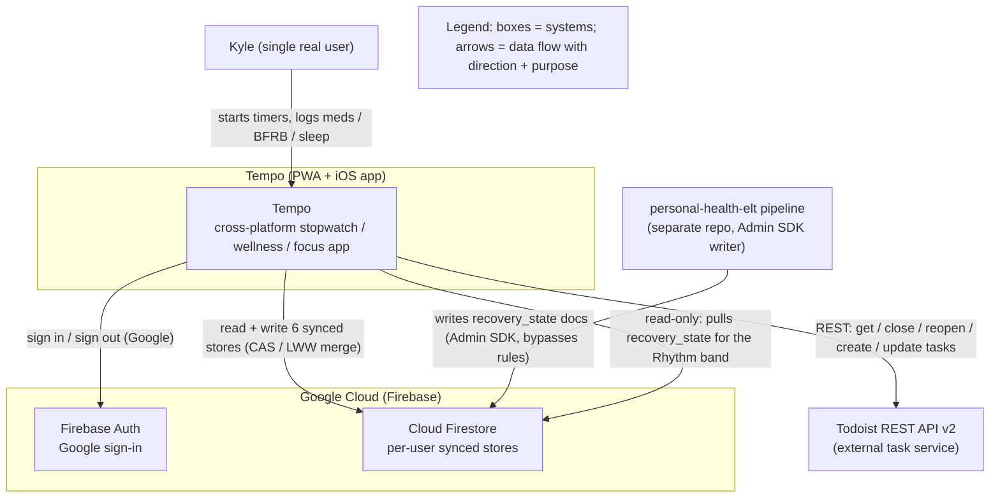
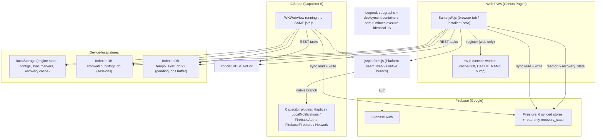
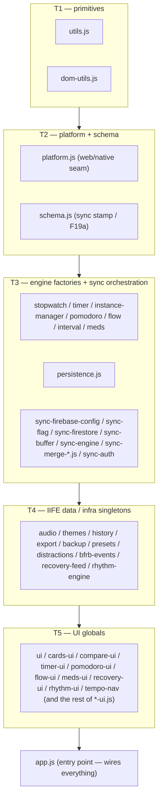
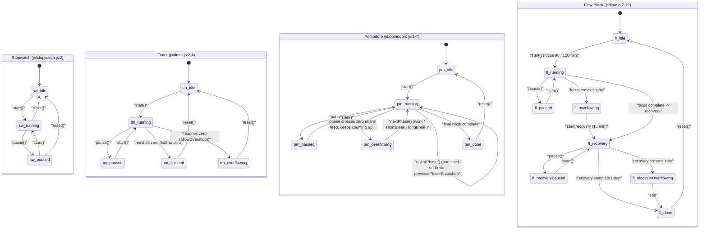
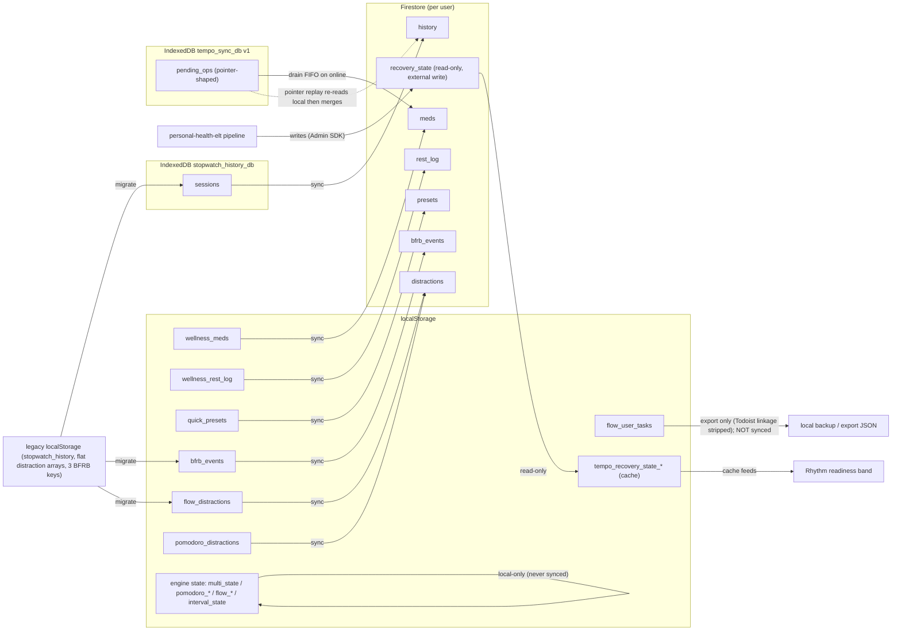
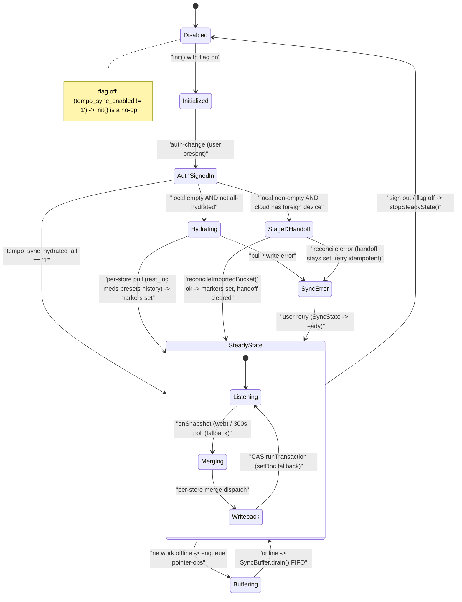

# Tempo — Architecture

> A narrative companion to the ADRs in [`docs/adr/`](adr/) and the standalone diagram
> sources in [`docs/diagrams/`](diagrams/). Every embedded Mermaid block below is byte-identical
> to its `.mmd` source so the two never drift. Anchors (`file.js:line`) are verified against the
> source, not the prose — treat CLAUDE.md as narrative and the code as ground truth.

## System overview

Tempo (repo name `stopwatch`) is a cross-platform timing, focus, and personal-wellness PWA. Its
headline differentiator is the ability to **start a stopwatch with time already on the clock**
("I took my meds ~30 minutes ago — count up from 30:00"), and that one feature dictates the whole
engine model: time is *derived from the wall clock*, never tick-accumulated (ADR 0002). Around that
core sits a Pomodoro engine, an ultradian Flow Block, an Interval engine, a Cooking mode, and a
Wellness suite (Meds, Exercise, Mindful, Cooking, Recovery) plus a Rhythm pillar.

The defining structural fact is that **one codebase ships two ways**. The web build is vanilla
HTML/CSS/JS with no framework and no build step — the `<script>` order in
[`index.html`](../index.html) (lines 1030-1119) literally *is* the dependency graph (ADR 0001). That
same static folder deploys to GitHub Pages on `git push`, and the *same* `js/*.js` runs unmodified
inside a Capacitor 6 `WKWebView` for the native iOS app (`com.ksdisch.tempo`). The web-vs-native
split is isolated entirely behind one file, [`js/platform.js`](../js/platform.js) (ADR 0007), so no
feature module ever branches on platform.

Tempo is **local-first with optional cloud sync**. All data lives on-device — engine state and
configuration in `localStorage`, session history in `IndexedDB` (`stopwatch_history_db`), and a
transient offline write-buffer in a second `IndexedDB` (`tempo_sync_db`). When the user opts into
cloud sync (off by default), [`js/sync-engine.js`](../js/sync-engine.js) orchestrates six per-user
Firestore stores with client-side conflict resolution (ADR 0003/0004). A *seventh* Firestore path,
`recovery_state`, is **read-only**: it is written by an external `personal-health-elt` pipeline (a
separate repo, using an Admin-SDK credential that bypasses the security rules) and Tempo only ever
reads it to paint the Rhythm readiness band ([`js/recovery-feed.js:5-12`](../js/recovery-feed.js),
[`firestore.rules:21-33`](../firestore.rules)).

---

## System context

The single real user drives Tempo; Tempo talks to three external systems. Firebase provides Google
sign-in and the Firestore sync backend. Todoist's REST API v2 is the cross-device source of truth
for task lists (so task state is reconciled through Todoist rather than Firestore). The
`personal-health-elt` pipeline is a one-way upstream writer of `recovery_state`.

The recovery feed's read-only boundary is enforced server-side: `recovery_state` documents allow
`read` for the owner but `write: if false` for every client
([`firestore.rules:21-33`](../firestore.rules)). A compromised client cannot poison its own feed.

---

## Containers

Two deployment containers run the *identical* JavaScript. The web PWA registers a cache-first
service worker (`sw.js`, web-only); the iOS app runs the JS in a `WKWebView` and reaches native
capabilities through Capacitor plugins. Both share the same device-local stores and the same Firebase
project (`tempo-sync-6f7b2`, [`js/sync-firebase-config.js:15`](../js/sync-firebase-config.js)).

---

## Module layering and load order

There is no module bundler and no `import`/`export`. Each `js/*.js` file attaches a global
(a factory function, an IIFE singleton, or plain UI functions), and the browser loads them in the
order the `<script>` tags appear in [`index.html`](../index.html) (lines 1030-1119). That ordering
*is* the dependency contract: a module may only call globals defined by a file that loaded earlier.
This is the subject of **[ADR 0001](adr/0001-no-build-script-load-order.md)**.

The load order falls into five tiers plus the entry point. Primitives (`utils`, `dom-utils`) load
first; then the platform seam and the sync-stamp schema; then engine factories and the entire sync
stack; then IIFE data/infra singletons; then the UI globals; and finally `app.js` wires everything.

A few load-order constraints are load-bearing and called out inline in `index.html`:
`distractions.js` must precede `pomodoro-ui.js` / `flow-ui.js`
([`index.html:1067-1070`](../index.html)); `todoist.js` must precede `pomodoro-ui.js` and
`tempo-nav.js` ([`index.html:1071-1076`](../index.html)); `recovery-feed.js` must precede
`rhythm-ui.js` ([`index.html:1098-1107`](../index.html)); and `bfrb-events.js` must precede
`global-bfrb.js` ([`index.html:1114-1117`](../index.html)).

---

## Engine model: drift-free timing

Every timing engine derives elapsed from the wall clock and never increments a counter on a tick.
The single invariant is `elapsed = offsetMs + accumulatedMs + (Date.now() - startedAt)`
([`js/stopwatch.js:12-18`](../js/stopwatch.js)); `accumulatedMs` only moves on an explicit `pause()`,
which folds the live delta in and nulls `startedAt` ([`js/stopwatch.js:26-31`](../js/stopwatch.js)).
The `requestAnimationFrame` loop in [`js/ui.js:405-446`](../js/ui.js) is purely cosmetic — it reads
`Stopwatch.getElapsedMs()` and paints, holding no time state, and self-terminates when status is no
longer `'running'` ([`js/ui.js:441-443`](../js/ui.js)). Tab-close resume is therefore free: a
restored `startedAt` plus a fresh `Date.now()` reconstructs the true elapsed on first read. This is
**[ADR 0002](adr/0002-drift-free-wall-clock-timing.md)**.

The status enums are taken from the engine source (note these differ from the older CLAUDE.md state
model — the code is authoritative). Stopwatch is `idle | running | paused`
([`js/stopwatch.js:2`](../js/stopwatch.js)). Timer adds `finished` and, when `allowOvershoot` is
set, `overflowing` ([`js/timer.js:2-4`](../js/timer.js)). Pomodoro uses
`idle | running | paused | overflowing | done` — `overflowing` replaced the old `phaseComplete`
([`js/pomodoro.js:1-7`](../js/pomodoro.js)) — with phase `work | shortBreak | longBreak` and a
one-level undo: `nextPhase()` captures `previousPhaseSnapshot` ([`js/pomodoro.js:160-164`](../js/pomodoro.js))
and `revertPhase()` folds the new phase's elapsed back into the restored total
([`js/pomodoro.js:200-213`](../js/pomodoro.js)). Flow Block is the widest machine:
`idle | running | paused | overflowing | recovery | recoveryPaused | recoveryOverflowing | done`
([`js/flow.js:7-12`](../js/flow.js)).

### The mutable-global-proxy primary instance

Up to five stopwatches and five timers can run at once, but one is "primary". The primary is exposed
through a *reassignable* global binding: `let Stopwatch = createStopwatch('sw-default')`
([`js/stopwatch.js:172`](../js/stopwatch.js)). When the user promotes a card to primary,
`InstanceManager.setPrimaryStopwatch(id)` simply reassigns that binding —
`Stopwatch = instance` ([`js/instance-manager.js:36-41`](../js/instance-manager.js)). Every module
that closed over the name `Stopwatch` (ui.js, offset-input.js, alert-ui.js) immediately operates on
the new primary with zero rewiring, because the RAF `tick()` re-resolves `Stopwatch` fresh each
frame ([`js/ui.js:412`](../js/ui.js), [`:438`](../js/ui.js)). This idiom is
**[ADR 0005](adr/0005-mutable-global-proxy-primary-instance.md)**; the swap sequence is
[`docs/diagrams/seq-instance-swap.mmd`](diagrams/seq-instance-swap.mmd).

---

## Persistence topology

Storage is split across `localStorage` (engine state, configs, sync markers, recovery cache),
`IndexedDB stopwatch_history_db` (the canonical `sessions` store,
[`js/history.js:2-3`](../js/history.js)), and a separate `IndexedDB tempo_sync_db` for the transient
offline write buffer. Two distinct IDB databases is deliberate — history is canonical user data, the
buffer is disposable sync infrastructure with an orthogonal lifecycle. This split is
**[ADR 0006](adr/0006-split-localstorage-indexeddb-persistence.md)**.

The non-obvious cases are what make the topology worth a diagram. The six synced stores
(`meds`, `history`, `rest_log`, `presets`, `bfrb_events`, `distractions`) flow up to Firestore; the
two distraction `localStorage` keys both collapse into the single Firestore `distractions` store.
`flow_user_tasks` is the deliberate exception — it is in local backup/export (with Todoist linkage
stripped, [`js/export.js:99`](../js/export.js), [`:158-159`](../js/export.js)) but **not** synced,
because Todoist itself is the cross-device source of truth. The `recovery_state` feed flows the other
way: external write → client read → `localStorage` cache → Rhythm band.

---

## Cloud sync architecture

Cloud sync is off by default — `SyncFlag` gates the whole engine on the `tempo_sync_enabled`
localStorage key ([`js/sync-flag.js`](../js/sync-flag.js)). When enabled and signed in,
[`js/sync-engine.js`](../js/sync-engine.js) (~2600 lines) runs the lifecycle: `init()` subscribes to
auth-change ([`:161-174`](../js/sync-engine.js)); a first sign-in on a fresh device triggers
`hydrateFromCloud()`, which pulls each store in order (`rest_log → meds → presets → history`,
[`:85`](../js/sync-engine.js)) and sets per-store + `_all` hydrate markers
([`:989-1170`](../js/sync-engine.js)); then `startSteadyState()` arms real-time `onSnapshot`
listeners as the primary propagation path with a 300s poll as defensive fallback
([`:99`](../js/sync-engine.js), [`:2425-2546`](../js/sync-engine.js)). A pre-existing-cloud-data
collision routes to the Stage-D `reconcileImportedBucket()` handoff
([`:1400-1793`](../js/sync-engine.js)). The choice of Firestore as backend is
**[ADR 0003](adr/0003-firestore-sync-backend.md)**.

### Components and conflict resolution

The orchestrator dispatches every store to its own merge module. The component view
([`docs/diagrams/c4-component-sync.mmd`](diagrams/c4-component-sync.mmd)) shows the registry of six
stores ([`js/sync-engine.js:138-145`](../js/sync-engine.js)), each with a `snapshotForSync()`
adapter, all routing cloud I/O through the single `sync-firestore.js` seam. Conflict resolution is
**per-store, per-record — never a global last-write-wins** — which is
**[ADR 0004](adr/0004-per-store-merge-strategy.md)**: meds use metadata-LWW plus doseLog
append-merge with a ±15-minute reconcile; history is union-by-id with record-level LWW and phaseLog
dedup; rest_log is per-date sleep-LWW plus naps append; presets are full-record LWW with `deletedAt`
tombstones; bfrb_events and distractions are union-dedup. Every incoming record first passes the
`Schema.isFutureRecord()` F19a guard ([`js/schema.js:37-42`](../js/schema.js)) so a downlevel client
refuses to overwrite data minted on a newer schema. The decision flow is
[`docs/diagrams/merge-decision.mmd`](diagrams/merge-decision.mmd); the hydrate + push + offline-buffer
sequence is [`docs/diagrams/seq-sync.mmd`](diagrams/seq-sync.mmd).

Native parity is the one unshipped piece: `SyncFirestore.runTransaction` (CAS) and
`SyncFirestore.subscribe` (listeners) are web-only — the native branches throw an explicit
"native parity pending" normalized error, and iOS falls back to the 5-minute poll plus per-record
`setDoc`. Closing that gap is **[ADR 0009](adr/0009-defer-native-cas-listener-parity.md)**.

---

## Platform seam (native)

[`js/platform.js`](../js/platform.js) is the single place the codebase branches on web vs native.
It funnels all 23 haptic call sites and 6 notification call sites — plus auth and network — through
`Platform.haptic` / `Platform.notify` / `Platform.scheduleNotification` / `Platform.auth` /
`Platform.network`. On web it routes to `navigator.vibrate`
([`js/platform.js:79-81`](../js/platform.js)), `new Notification` ([`:118-120`](../js/platform.js)),
the service-worker `BgNotify` path ([`:142-144`](../js/platform.js)), a lazy CDN import of the
Firebase Auth SDK ([`:237-253`](../js/platform.js)), and `navigator.onLine`
([`:555-565`](../js/platform.js)). On native it routes to `@capacitor/haptics`
([`:27-72`](../js/platform.js)), `@capacitor/local-notifications` ([`:102-145`](../js/platform.js)),
`@capacitor-firebase/authentication` ([`:336-355`](../js/platform.js)), and `@capacitor/network`
([`:482-538`](../js/platform.js)). This abstraction is **[ADR 0007](adr/0007-capacitor-native-wrapper.md)**;
the funnel is drawn in [`docs/diagrams/platform-seam.mmd`](diagrams/platform-seam.mmd).

One Capacitor-adjacent product decision worth surfacing here: Todoist auth uses a device-local
**personal API token**, not OAuth, because a no-backend PWA has nowhere to hold an OAuth client
secret — **[ADR 0008](adr/0008-todoist-personal-token-not-oauth.md)**. The token is `localStorage`-only,
never synced, and excluded from exports.

---

## Deployment and operations

The web build deploys via GitHub Pages from `main` root — `git push` auto-deploys in ~1 minute.
Because the service worker is cache-first, **any change to a cached web file must bump `CACHE_NAME`
in `sw.js` in the same change**, or users keep seeing stale content until the old SW expires. This
is the single most common operational footgun and is enforced as a hard rule in CLAUDE.md.

iOS is a separate target from the same source: `scripts/sync-www.mjs` mirrors the static files into
`www/`, `npx cap copy` bundles them, and Xcode builds the app (`com.ksdisch.tempo`). The free
personal signing cert needs a 7-day refresh per the `iOS-BUILD.md` playbook until the $99/yr Apple
Developer Program enrollment lands. Historically there was **no CI** (vanilla JS, no toolchain;
engine tests run by opening `tests/index.html` in a real browser). That gap is now closing via a
[`.github/workflows/ci.yml`](../.github/workflows/ci.yml) check.

---

## Decision index

| ADR | Title | Status |
|-----|-------|--------|
| [0001](adr/0001-no-build-script-load-order.md) | No build step; script load order in `index.html` IS the dependency graph | Accepted |
| [0002](adr/0002-drift-free-wall-clock-timing.md) | Drift-free wall-clock timing — elapsed is derived, never tick-accumulated | Accepted |
| [0003](adr/0003-firestore-sync-backend.md) | Firebase/Firestore as the cloud-sync backend | Accepted |
| [0004](adr/0004-per-store-merge-strategy.md) | Per-store, per-record conflict resolution instead of global last-write-wins | Accepted |
| [0005](adr/0005-mutable-global-proxy-primary-instance.md) | Mutable-global-proxy primary instance | Accepted |
| [0006](adr/0006-split-localstorage-indexeddb-persistence.md) | Split localStorage / IndexedDB persistence | Accepted |
| [0007](adr/0007-capacitor-native-wrapper.md) | Capacitor native wrapper (one codebase, two runtimes) | Accepted |
| [0008](adr/0008-todoist-personal-token-not-oauth.md) | Todoist personal API token (not OAuth) | Accepted |
| [0009](adr/0009-defer-native-cas-listener-parity.md) | Deferred native CAS / listener parity | Accepted |

> ADRs 0005-0009 were retro-documented in the Tier 2 artifacts round (see
> [`docs/adr/README.md`](adr/README.md)) and are now Accepted; the links above resolve.

## Diagrams

All sources live in [`docs/diagrams/`](diagrams/) and render on GitHub.

- [`c4-context.mmd`](diagrams/c4-context.mmd) — system context (embedded above)
- [`c4-container.mmd`](diagrams/c4-container.mmd) — containers (embedded above)
- [`c4-component-sync.mmd`](diagrams/c4-component-sync.mmd) — cloud-sync component view
- [`layers.mmd`](diagrams/layers.mmd) — module load-order tiers (embedded above)
- [`state-sync.mmd`](diagrams/state-sync.mmd) — SyncEngine lifecycle (embedded above)
- [`state-engines.mmd`](diagrams/state-engines.mmd) — timing-engine state machines (embedded above)
- [`data-topology.mmd`](diagrams/data-topology.mmd) — persistence data-flow (embedded above)
- [`merge-decision.mmd`](diagrams/merge-decision.mmd) — per-store conflict resolution
- [`seq-sync.mmd`](diagrams/seq-sync.mmd) — hydrate + push + offline-buffer sequence
- [`seq-instance-swap.mmd`](diagrams/seq-instance-swap.mmd) — mutable-global-proxy primary swap
- [`platform-seam.mmd`](diagrams/platform-seam.mmd) — web/native funnel
