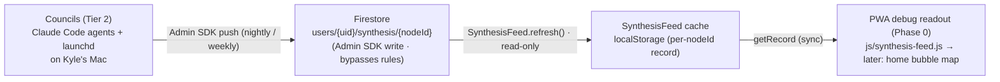
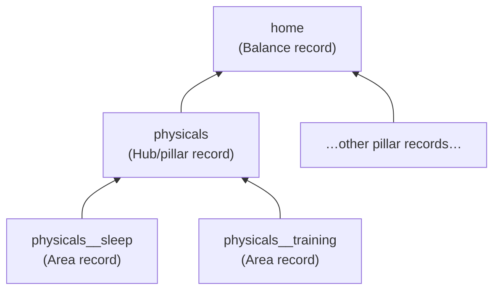

# Synthesis-record data contract (`synthesis`)

- **Status:** Frozen contract, `contractVersion 1` (fixed in build Phase 0, 2026-06-08)
- **Producer:** the local-first councils (Claude Code agents + launchd routines on Kyle's Mac), Firebase Admin SDK
- **Consumer:** Tempo / life-OS trunk, read-only — `js/synthesis-feed.js`
- **Direction:** One-way. The PWA never writes these documents; the councils are authoritative.

## Overview

`synthesis` is the read-only Firestore feed that carries the **output of the life-OS
councils** back to the device. It is the keystone of the federated "hub of hubs": even
though the *intelligence* (the synthesizers) is tethered to the Mac (Tier 2), the
*output* is readable on any device (Tier 1) because every council node **writes its
synthesis record back to Firestore** (`docs/lifeos/architecture.md` §1, §3).

A **synthesis record** is one small structured summary emitted by a single synthesizer
node — an **Area** (leaf, e.g. *Physicals/Sleep*), a **Hub/pillar** (e.g. *Physicals*),
or the **Home** (the cross-pillar Balance node). The recursion rule is the whole point:
**parents read their children's *records*, never the children's raw data.** That is
simultaneously the roll-up mechanism and the core token-discipline mechanism — a pillar
reads a handful of one-paragraph child summaries instead of thousands of rows
(`docs/lifeos/decisions/0005-synthesis-record-rollup-and-token-discipline.md`).

This feed follows the **same trust model as `recovery_state`**
([`../reference/recovery-state-contract.md`](../reference/recovery-state-contract.md)):
the producer writes with a Firebase Admin service-account credential (which **bypasses**
`firestore.rules`), and the signed-in client only ever **reads**. There is no
`Schema.stamp` / `deviceId` / `updatedAt` sync envelope and no client-side merge logic —
the councils are authoritative, the consumer adapts. The record instead carries its own
small producer envelope (`contractVersion` / `producer` / `producedAt` / `window`) that
the council stamps when it emits, so the device can tell *who* produced *what window*
and *when* without any negotiation channel between the two runtimes.

The frozen shape is pinned language-neutrally in
[`synthesis-record.schema.json`](synthesis-record.schema.json) (JSON Schema, draft
2020-12) — that file is the SSOT; this doc is its human narration.

## Documents

The councils write one document **per synthesizer node** under the user's synthesis
subcollection:

| Doc       | Firestore path                          | Payload                                              |
|-----------|-----------------------------------------|------------------------------------------------------|
| `{nodeId}`| `users/{uid}/synthesis/{nodeId}`        | One synthesis record (object) for that node's window |

**`nodeId` encoding.** The record's `node` field is a **dotted tree path** (e.g.
`physicals/sleep`), but **Firestore document IDs cannot contain `/`**. So the document ID
is the node path with every `/` replaced by `__` (double underscore):

| `node` (dotted path) | `nodeId` (document ID) |
|----------------------|------------------------|
| `home`               | `home`                 |
| `physicals`          | `physicals`            |
| `physicals/sleep`    | `physicals__sleep`     |

The encoding is mechanical and reversible (`split('__').join('/')`), so a consumer can map
either direction. The authoritative path is always the dotted `node` field **inside** the
record; `nodeId` is just its filesystem-safe document key.

**The 3-level roll-up.** Records form a tree, and the document set mirrors it
(`docs/lifeos/architecture.md` §3):

1. **Area** (leaf, e.g. `physicals/sleep`) reads raw metrics for its slice → emits a record.
2. **Hub / pillar** (e.g. `physicals`) reads its **Areas' records** → emits a pillar record.
3. **Home** (`home`) reads the **five pillar records** → emits the Balance read + the week's
   headline + 1–3 prioritized cross-pillar moves.

A parent never re-reads a child's raw data; it reads only the child's *record* from this
same collection. That recursion is what keeps each synthesizer's context small.

## Record schema

Every document in the collection — Area, Hub, and Home alike — carries the **same** frozen
shape. The field table below is the human reading of
[`synthesis-record.schema.json`](synthesis-record.schema.json); the schema file is the
binding spec.

| Field             | Type                               | Meaning                                                                                          | Required? |
|-------------------|------------------------------------|--------------------------------------------------------------------------------------------------|-----------|
| `contractVersion` | integer (`const 1`)                | The contract revision. Bumped **only** on a breaking shape change.                               | yes       |
| `node`            | string                             | Dotted tree path (`physicals/sleep`), or `"home"` for the root. The authoritative node identity. | yes       |
| `producer`        | string                             | Which council job/agent emitted the record (e.g. `council/nightly-light`).                        | yes       |
| `producedAt`      | string (ISO-8601 UTC)              | When the council produced this record. The council stamps it.                                    | yes       |
| `window`          | string                             | The window summarized: `"<ISOdate>..<ISOdate>"` (a range) **or** a single ISO date.              | yes       |
| `state`           | object `{ band, score }`           | The node's normalized read. `band` enum below; `score` integer 0..100 **or** `null`.             | yes       |
| `headline`        | string (≤ 140 chars)               | One-line human summary of the window.                                                            | yes       |
| `signals`         | string[] (**max 5**)               | Top-N evidence strings — the "discard non-useful info" lever. At most 5 items.                   | yes       |
| `nudges`          | `[{ text: string, priority: int≥1 }]` | Prospective suggested moves; `priority` 1 = highest. **Optional**, defaults to `[]`.          | no        |
| `provenance`      | object `{ sources, coverage }`     | `sources`: string[] of inputs drawn on. `coverage`: float 0..1 of expected data present.         | yes       |
| `confidence`      | string                             | `"high"` \| `"medium"` \| `"low"` — guards against over-claiming on thin data.                   | yes       |

**`state.band` enum** — buckets the score:

| Band         | Score range            | Meaning                                  |
|--------------|------------------------|------------------------------------------|
| `thriving`   | 80–100                 | At or above target.                      |
| `steady`     | 60–79                  | Healthy, holding.                        |
| `strained`   | 40–59                  | Running below target; attention warranted.|
| `depleted`   | 0–39                   | Well below target.                       |
| `unknown`    | (score is `null`)      | No data / insufficient signal to score.  |

`score` is the canonical number (an integer `0..100`, or `null`); `band` is its categorical
bucket. When `score` is `null`, `band` is `unknown`. The score is computed **relative to the
node's own target/baseline**, so bands are comparable across pillars without comparing apples
to oranges (`docs/lifeos/decisions/0004-balance-importance-x-neglect.md`).

**`confidence` enum:** `"high"` | `"medium"` | `"low"`. Together with
`provenance.coverage`, this is how a **parent down-weights a thin-data child** instead of
treating it as gospel — the "checks and balances / discard non-useful info" discipline,
realized structurally rather than as a bolt-on.

**Honesty notes on the shape:**

- `signals` is **capped at 5** by the schema. The cap *is* the contract — anything below the
  top 5 is archived upstream, never published, so the consumer can render the full array
  without trimming.
- `nudges` is the **one optional field**; absent it defaults to `[]`. A daily-glance Area
  record may carry no nudges, while a weekly Home record usually does.
- `score` may be `null` (with `band: "unknown"`) — a node that ran but had no data still emits
  a record rather than vanishing, so a parent can see the node exists and is thin rather than
  silently missing it.
- The councils **may emit additional fields** not listed here. The contract is **additive-only**
  (see *Versioning* below): every consumer reads a fixed subset and ignores unknown keys, so
  the schema's `additionalProperties: true` is intentional, not laxity.

## Access control

Access is enforced entirely by `firestore.rules`, **not** by the client — exactly as
`recovery_state` is. The `synthesis` collection is a **read-only feed**: the councils write it
via the Firebase Admin SDK (which bypasses rules), and the signed-in client only reads.

Two guarantees, identical in shape to the recovery feed:

1. **Read-only for clients.** Client writes to `synthesis` are denied; the Admin
   service-account bypasses rules, so the councils write freely while a compromised or buggy
   client cannot poison its own synthesis feed.
2. **Per-user isolation.** A client may read only its own UID's documents
   (`isOwner(userId)` = `request.auth != null && request.auth.uid == userId`). No cross-user
   reads.

**The non-obvious part — the read-only guarantee comes from the catch-all *exclusion*, not
from block order.** This mirrors `recovery_state` precisely (see
[`../reference/recovery-state-contract.md`](../reference/recovery-state-contract.md) §Access
control). Firestore evaluates rules **cumulatively**: a write is allowed if **any** matching
rule grants it, and match-block **order is irrelevant**. The general user block uses a
recursive wildcard:

```
match /users/{userId}/{collection}/{docId=**} {
  allow read: if isOwner(userId);
  allow write: if isOwner(userId) && collection != 'recovery_state';
}
```

That `{docId=**}` recursive wildcard **also** matches `synthesis/{nodeId}`, so a dedicated
`allow write: if false` block for `synthesis` is **necessary but not sufficient on its own** —
the broad grant would re-grant the write a narrower `if false` cannot subtract. **The
read-only guarantee is enforced by adding `synthesis` to the catch-all's exclusion**, exactly
as `recovery_state` already is, i.e. `collection != 'recovery_state' && collection !=
'synthesis'` (or an equivalent set-membership check). A more-specific `if false` block alone
would *not* hold.

> **Note for the rules owner (Agent C / whoever edits `firestore.rules`):** this contract doc
> only *describes* the required policy; it does **not** edit `firestore.rules`. Wiring the
> `synthesis` carve-out into the live rules (and its rules-unit test, mirroring the
> `recovery_state` test in `tests/rules/firestore-rules.test.mjs`) is a separate, gated change
> owned by the rules file. Until that lands, `synthesis` documents written by an Admin council
> are still safe (Admin bypasses rules), but a client could in principle write its own
> synthesis — close the exclusion to make the feed truly read-only.

## Client behaviour (`js/synthesis-feed.js`)

The trunk's consumer is `js/synthesis-feed.js` — an IIFE singleton built on the same pattern
as `RecoveryFeed` (`js/recovery-feed.js`). Its expected surface:

- **Cache to `localStorage`.** Each fetched node record caches locally (keyed per `nodeId`, or
  as one `nodeId → record` map) so the home/bubble map renders offline. Reads are synchronous
  reads of the cache, never live Firestore calls on the render path.
- **Three-condition fetch gate**, identical to `RecoveryFeed._canFetch`: a fetch is attempted
  only when (1) `SyncFlag.isEnabled()` is true, (2) the `SyncAuth` singleton is present, and
  (3) `SyncAuth.getCurrentUser()` returns a user with a `uid`. Any failed condition returns
  `null` → no network call.
- **`getRecord(node)`** — synchronous lookup of one node's cached record by its dotted `node`
  path (encoding to `nodeId` internally). Returns `null` when the cache is empty, the node was
  never produced, or the input is malformed — the caller hides that card on `null`.
- **`refresh()`** — pulls the node records the home needs and writes through to cache.
  Concurrent calls dedup to a single in-flight promise. Per-node fetches are independent so a
  missing child record does not void the rest.
- **Auth-change wiring** — subscribes to the SyncEngine `auth-change` event: **sign-in** →
  `refresh()`; **sign-out** (user `null`) → clear the cache so a different account's stale
  synthesis never bleeds through. A best-effort `refresh()` runs on boot if already signed in.

**Phase-0 scope — a debug readout, not the home UI.** In Phase 0 the consumer is wired to a
**debug readout** that proves the round-trip end-to-end (a council writes a record → it lands
in Firestore → `SynthesisFeed` caches it → the device displays it). The full bubble-map / home
synthesis cards are later-phase UI; this contract only guarantees the **feed**, not its
presentation.

### Silent-degrade matrix

Like the recovery band, the synthesis readout degrades **silently** — no error, no toast —
under each of these (the same trust posture as `recovery_state`):

| Condition                      | Cause                                   | Result                                                  |
|--------------------------------|-----------------------------------------|---------------------------------------------------------|
| Sync flag off                  | User hasn't opted into cloud sync       | Gate → null; cache may still serve a prior record       |
| Signed out                     | `getCurrentUser()` is null              | Gate → null; sign-out also clears the cache             |
| No record yet                  | Councils haven't produced this node     | `getDoc` returns `data: null`; that card hides          |
| Offline                        | Network gone                            | Cached record still serves                              |
| Council failed silently        | launchd job / CLI auth drifted (Tier 2) | Record goes stale; `producedAt` is the staleness signal |

**Contract risk — silent degradation + tethered producer.** Every failure above is *silent by
design* — acceptable for a single-user portfolio life-OS. But it compounds with the Tier-2
reality that **councils only fire while the Mac is on** and (per the `job-search-mas`
precedent) **fail silently if the Claude Code CLI auth drifts**
(`docs/lifeos/architecture.md` §1). So **failure alerting (Slack/SMS) on the producer side is
mandatory, not optional**, and `producedAt` is the device-side staleness tell — a record whose
`producedAt` is days old means the council stopped, not that nothing happened.

## Versioning / change policy

The contract is governed by `contractVersion` (currently `1`) and is **additive-only**, the
same rule `recovery_state` follows:

1. **Additive-only changes are safe.** New record fields (or new optional sub-keys) are safe —
   every consumer reads a fixed subset and ignores unknown fields (`additionalProperties: true`
   in the schema). The councils may enrich records without breaking the device, and **without**
   bumping `contractVersion`.
2. **A rename or removal is the one gated, breaking act.** Renaming/removing any required field
   (`node`, `producer`, `producedAt`, `window`, `state`, `headline`, `signals`, `provenance`,
   `confidence`), changing an enum value, or restructuring `state`/`provenance` is breaking. It
   **must** bump `contractVersion` (the integer is reserved for exactly this), update
   [`synthesis-record.schema.json`](synthesis-record.schema.json), and coordinate the producer
   (councils) with the consumer (`js/synthesis-feed.js`) — there is no negotiation channel
   between the two runtimes, so the change is a deliberate, two-sided edit.
3. **Contract-test on the producer side.** As with `personal-health-elt`'s
   `guard-mart-contract` hook, the councils should validate every record they emit against
   `synthesis-record.schema.json` before writing it, so a producer-side drift fails loudly at
   write time rather than silently blanking a card on the device
   (`docs/lifeos/integration-plan.md` §5).

## Lineage



Within the producer, the roll-up itself is recursive — a parent reads its children's
**records** from the same collection, never their raw data:



## See also

- [`synthesis-record.schema.json`](synthesis-record.schema.json) — the language-neutral SSOT
  (JSON Schema draft 2020-12) this doc narrates.
- [`pillar-feed.md`](pillar-feed.md) — the generalized inbound-mart contract; `synthesis` is the
  council-produced internal feed, `pillar-feed` covers the externally-federated Module feeds.
- [`../reference/recovery-state-contract.md`](../reference/recovery-state-contract.md) — the live
  worked exemplar this contract mirrors (read-only Firestore feed, Admin-write, catch-all
  exclusion).
- `js/recovery-feed.js` — the read-only consumer pattern `js/synthesis-feed.js` follows (cache,
  three-condition gate, refresh-dedup, auth-change wiring).
- `firestore.rules` — where the `synthesis` read-only carve-out is enforced (the catch-all
  exclusion, owned by the rules file — not edited by this doc).
- `docs/lifeos/architecture.md` §3 (synthesis-record model) + §7 (integration contracts), and
  `docs/lifeos/decisions/0005-synthesis-record-rollup-and-token-discipline.md` — the design
  rationale; `docs/lifeos/decisions/0003-federated-repos-evolve-tempo-as-trunk.md` — why the
  contracts live in the trunk.
