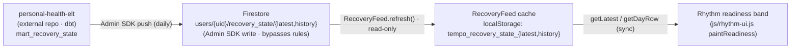

# Recovery-state data contract (`recovery_state`)

- **Status:** Implicit-in-code contract, documented retro 2026-05-30
- **Producer:** `personal-health-elt` (separate repo, Firebase Admin SDK)
- **Consumer:** Tempo, read-only — `js/recovery-feed.js`
- **Direction:** One-way. Tempo never writes these documents.

## Overview

`recovery_state` is the one read-only Firestore feed Tempo consumes. Every other
synced store (`meds` / `history` / `rest_log` / `presets` / `bfrb_events` /
`distractions`) is read-write and merged client-side. This one is not: an
**external** pipeline named `personal-health-elt` — a separate repo, not part of
this codebase — runs a dbt build over Apple Health exports, materializes a daily
mart called `mart_recovery_state`, and pushes the result into Firestore using a
**Firebase Admin service-account credential**. Admin SDK writes **bypass**
`firestore.rules` entirely, so the pipeline writes freely while the Tempo client
is denied write access by rule (`firestore.rules:21-33` — the `if false` block
plus the catch-all's `collection != 'recovery_state'` exclusion; see *Access
control* below).

Tempo's only job is to **read** the latest row, **cache** it to `localStorage`,
and **render** it as the Rhythm readiness band. There is no write path, no
`Schema.stamp` / `deviceId` / `updatedAt` envelope, and no merge logic — the
pipeline is authoritative (`js/recovery-feed.js:1-12`). This makes the contract
one-directional: the producer defines the shape, the consumer adapts, and there
is no negotiation channel between the two repos (see *Versioning* below).

The mart name is `mart_recovery_state` (`js/recovery-feed.js:1-2`; also noted in
`tests/index.html`).

## Documents

The pipeline writes exactly two documents per user, both under the user's
recovery subcollection (`js/recovery-feed.js:5-7`, `js/recovery-feed.js:100-101`):

| Doc       | Firestore path                            | Payload                                  |
|-----------|-------------------------------------------|------------------------------------------|
| `latest`  | `users/{uid}/recovery_state/latest`       | A single most-recent day row (object).   |
| `history` | `users/{uid}/recovery_state/history`      | `{ rows: [ …last ~14 day rows ] }`       |

- `latest` is the single newest day row — the object the readiness band shows by
  default (`js/recovery-feed.js:64-68`).
- `history` is a **wrapper object** with a `rows` array, not a bare array. The
  client reads `history.rows` and looks up a single day by its `.day` key
  (`js/recovery-feed.js:80-85`). The window is **N=14 days, server-side** — the
  client never trims it and treats the count as advisory
  (`js/recovery-feed.js:70`).

## Row schema

The row shape is **defined upstream** and not formally specified in this repo —
it is reverse-engineered from what the consumer reads (`js/rhythm-ui.js`) and the
test fixtures (`tests/recovery-feed.test.js`). Document only what is verifiable;
flag the rest.

| Field             | Type     | Meaning                                                              | Verified-from                                              |
|-------------------|----------|---------------------------------------------------------------------|------------------------------------------------------------|
| `day`             | string   | ISO `YYYY-MM-DD` date key; the row's primary key for lookups.        | `js/recovery-feed.js:84`, `js/rhythm-ui.js:149`, `tests/recovery-feed.test.js:43`,`91` |
| `recovery_signal` | string   | Categorical readiness band. Enum below. Falls back to `insufficient_data` when absent/non-string. | `js/rhythm-ui.js:175-179` |
| `hrv_ms`          | number   | Heart-rate variability in milliseconds. Rendered `toFixed(1)`.      | `js/rhythm-ui.js:184-185`, `tests/recovery-feed.test.js:43` |
| `acwr`            | number   | Acute:chronic workload ratio. Rendered `toFixed(2)`.                | `js/rhythm-ui.js:187-188`, `tests/recovery-feed.test.js:48` |
| `rhr_bpm`         | number   | Resting heart rate, beats/min. Rendered `Math.round(…)` bpm.        | `js/rhythm-ui.js:190-191`                                  |

**`recovery_signal` enum** — the four values the UI recognizes
(`js/rhythm-ui.js:89-100`):

| Value               | Band label         | Emoji            |
|---------------------|--------------------|------------------|
| `well_recovered`    | "Well-recovered"   | 🟢 green circle  |
| `neutral`           | "Neutral"          | 🟡 yellow circle |
| `strained`          | "Strained"         | 🔴 red circle    |
| `insufficient_data` | "Insufficient data"| ⚪ white circle  |

Any unrecognized `recovery_signal` string falls through to the
`insufficient_data` emoji/label (`js/rhythm-ui.js:178-179`).

**Honesty notes on the shape:**

- All secondary metrics (`hrv_ms`, `acwr`, `rhr_bpm`) are **optional per-row** —
  the consumer guards each with `typeof … === 'number'` and silently omits a
  missing one rather than printing a placeholder (`js/rhythm-ui.js:181-192`).
  `rhr_bpm` is only shown when fewer than two other metrics are present
  (`js/rhythm-ui.js:190`), so its presence in the payload is not guaranteed to
  surface.
- `day` and `recovery_signal` are the only fields the band strictly needs:
  `paintReadiness` hides the band entirely when `row.day` is falsy
  (`js/rhythm-ui.js:169-173`).
- The pipeline **may emit additional fields** not listed here — the consumer
  reads a fixed subset and ignores the rest. Treat this table as the *consumed*
  surface, not an exhaustive payload spec (observed in `js/rhythm-ui.js`; not
  exhaustively specified upstream-in-repo).

## Access control

Access is enforced entirely by `firestore.rules`, not by the client. Two match
blocks under `/databases/{database}/documents` carry the policy. The recovery
feed has its own block (`firestore.rules:21-24`):

```
match /users/{userId}/recovery_state/{docId} {
  allow read: if isOwner(userId);
  allow write: if false;
}
```

Two guarantees:

1. **Read-only for clients.** `allow write: if false` denies the client write in
   this block. The `personal-health-elt` Admin service-account bypasses rules, so
   it writes freely while a compromised or buggy client cannot poison its own feed
   (`firestore.rules:8-11`).
2. **Per-user isolation.** A client may read only its own UID's documents
   (`isOwner(userId)` = `request.auth != null && request.auth.uid == userId`,
   `firestore.rules:4-6`). No cross-user reads.

**Why the catch-all must exclude `recovery_state` (the non-obvious part).**
`allow write: if false` above is necessary but **not sufficient on its own**,
because Firestore evaluates rules **cumulatively**: a write is allowed if *any*
matching rule grants it, and match-block **order is irrelevant**. The general
user block uses a recursive wildcard (`firestore.rules:30-33`):

```
match /users/{userId}/{collection}/{docId=**} {
  allow read: if isOwner(userId);
  allow write: if isOwner(userId) && collection != 'recovery_state';
}
```

That `{docId=**}` recursive wildcard **also** matches `recovery_state/latest`, so
without the `collection != 'recovery_state'` exclusion its `allow write` would
re-grant the very write the block above denies — a more-specific `if false`
cannot subtract a broader grant. **The exclusion is what actually makes the feed
read-only.** (An earlier version of these rules, and of this section, claimed the
guarantee came from declaring the specific block "first"; that was wrong — block
order has no effect, and the old rules let a client write its own
`recovery_state`. A rules-unit test now pins the real behavior:
`tests/rules/firestore-rules.test.mjs`; see also
[`docs/runbooks/firestore-rules-publish.md`](../runbooks/firestore-rules-publish.md).)
See ADR 0003 §Decision for the carve-out rationale
(`docs/adr/0003-firestore-sync-backend.md`).

## Client behaviour

`RecoveryFeed` is an IIFE singleton (`js/recovery-feed.js:19`). Its surface:

- **Cache to `localStorage`.** Both docs cache under
  `tempo_recovery_state_latest` and `tempo_recovery_state_history`
  (`js/recovery-feed.js:20-21`). The cache is what makes the band render offline
  — `getLatest()` / `getHistory()` / `getDayRow()` are **synchronous reads of the
  cache**, never live Firestore calls (`js/recovery-feed.js:64-85`).
- **Three-condition fetch gate** (`_canFetch`, `js/recovery-feed.js:53-60`):
  fetch is attempted only when (1) `SyncFlag.isEnabled()` is true, (2) a
  `SyncAuth` singleton is present, and (3) `SyncAuth.getCurrentUser()` returns a
  user with a `uid`. Any failed condition returns `null` → no network call.
- **`getDayRow(dateKey)`** (`js/recovery-feed.js:80-85`): synchronous lookup of a
  single past day in the cached `history.rows`, matched on `r.day === dateKey`.
  Returns `null` for a non-string input, an empty/absent cache, or a date outside
  the 14-day window. Used by the Rhythm day-picker to paint past-day bands
  (`js/rhythm-ui.js:164-166`).
- **`refresh()`** (`js/recovery-feed.js:95-126`): pulls both docs and writes
  through to cache. Concurrent calls **dedup** to a single in-flight promise
  (`js/recovery-feed.js:96`,`121`). The `latest` read is primary; the `history`
  read is wrapped independently so a missing/failed history doc does **not** void
  the latest read (`js/recovery-feed.js:111-118`). Returns the latest payload, or
  `null` when the gate is closed.
- **Auth-change wiring** (`init`, `js/recovery-feed.js:132-155`): subscribes to
  the SyncEngine `auth-change` event (emitted from `js/sync-auth.js:57-58`).
  **Sign-in** → `refresh()`. **Sign-out** (user is null) → `_clearCache()`, so a
  different account's stale band never bleeds through
  (`js/recovery-feed.js:141-147`). On boot, a best-effort `refresh()` runs if the
  user is already signed in (`js/recovery-feed.js:151-154`).

### Silent-degrade matrix

The band renders nothing — no error, no toast — under each of these
(`js/recovery-feed.js:14-18`):

| Condition                        | Cause                                  | Result                                                |
|----------------------------------|----------------------------------------|-------------------------------------------------------|
| Sync flag off                    | User hasn't opted into cloud sync      | `_canFetch` → null; cache may still serve a prior row |
| Signed out                       | `getCurrentUser()` is null             | `_canFetch` → null; sign-out also clears the cache    |
| No doc yet                       | Pipeline hasn't pushed for this user   | `getDoc` returns `data: null`; cache unchanged        |
| Offline                          | Network gone                           | Cached value still serves the band                    |
| Future / non-today day selected  | Mart only describes the past           | Band hidden (`js/rhythm-ui.js:133-140`)               |
| Stale latest row (`day` < today) | Mart lags 1–2 days behind calendar     | Band shows the row with an "as of …" suffix (`js/rhythm-ui.js:144-158`,`102-121`) |

## Failure modes

- **Missing `latest` doc** → `getDoc` returns `{ data: null }`, cache is not
  overwritten, `getLatest()` returns `null`, band hides
  (`js/recovery-feed.js:107-109`, `js/rhythm-ui.js:126-130`,`169-173`).
- **Missing/failed `history` doc** → non-fatal. The history fetch is wrapped in
  its own `try/catch` and swallowed; the `latest` read still succeeds
  (`js/recovery-feed.js:111-118`). Past-day lookups via `getDayRow` then return
  `null` and those bands hide.
- **Malformed cached JSON** → `_readJSON` catches the parse error and returns
  `null`; the band hides instead of throwing (`js/recovery-feed.js:27-35`,
  `tests/recovery-feed.test.js:51-55`,`118-120`).
- **Unknown `recovery_signal`** → falls through to `insufficient_data`
  (`js/rhythm-ui.js:178-179`); the band still renders, just neutral-white.

**Contract risk — silent degradation.** Every failure above is *silent by
design*. There is no surfaced error when the pipeline stops pushing, pushes a
malformed row, or renames a field. The band simply blanks or goes stale. That is
acceptable for a single-user portfolio app, but it means a **breaking upstream
shape change is invisible from inside Tempo** — the band just disappears with no
diagnostic. This is the central risk of an implicit, undocumented-until-now
contract.

## Lineage



## Versioning / change policy

There is **no negotiation channel** between the two repos — the producer
(`personal-health-elt`) and the consumer (Tempo) are separate codebases with no
shared schema artifact and no compile-time link. The contract is implicit,
discoverable only by reading `js/recovery-feed.js:1-19` and the
`firestore.rules:8-20` comments.

Rules of engagement:

1. **Additive-only upstream.** New row fields are safe — the consumer reads a
   fixed subset and ignores the rest (`js/rhythm-ui.js:181-192`). The pipeline may
   add metrics without breaking Tempo.
2. **A breaking shape change blanks the band silently.** Renaming `day`,
   `recovery_signal`, `hrv_ms`, `acwr`, or `rhr_bpm`, or changing `history` away
   from `{ rows: [...] }`, produces **no error** — the band just hides or drops
   readouts. Coordinate any such change in the `personal-health-elt` repo, since
   Tempo will not warn you.
3. **Recommended: a contract-validation test (forward pointer).** Add a fixture
   test that asserts the row shape this doc pins down (the field table + the
   `recovery_signal` enum), so a CI-time signal fires when the consumed surface
   drifts. The existing `tests/recovery-feed.test.js` fixtures
   (`tests/recovery-feed.test.js:43`,`66`,`91`) are the natural home for this.

## See also

- `js/recovery-feed.js` — the read-only consumer module (cache, gate, refresh,
  auth-change wiring).
- `firestore.rules` — the read-only + per-user-isolation guarantee
  (`firestore.rules:21-33`).
- `docs/reference/data-dictionary.md` — the broader datastore reference
  (*planned*; `recovery_state` rolls up there alongside the 6 synced stores).
- `docs/adr/0003-firestore-sync-backend.md` — ADR 0003, which records the
  Firestore backend decision and the same `recovery_state` read-only carve-out.
